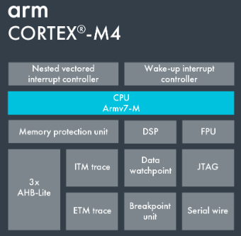
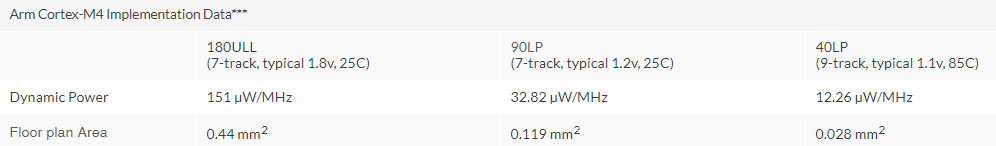
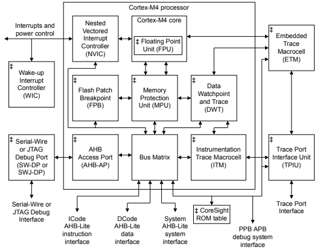

# [Cortex M4](https://github.com/sochub/CM4) 

 

####  qitas@qitas.cn

#### 归属：[Cortex M](https://github.com/sochub/CM) 
#### 编译：[arm-none-eabi](https://github.com/sochub/arm-none-eabi) 

## [简介](https://github.com/sochub/CM4/wiki)

 

Architecture：Armv7E-M Harvard

Interrupts：Non-maskable Interrupt (NMI+ 1 to 240 physical interrupts)

Priority ：8 to 256 priority levels

 

Performance Efficiency: 3.40 CoreMark/MHz*
- Without FPU: 1.25 / 1.52 / 1.91 DMIPS/MHz**
- With FPU: 1.27 / 1.55 / 1.95 DMIPS/MHz**

 

## [收录](https://github.com/sochub/CM4)

#### [STM32F4系列](https://github.com/sochub/STM32F4) 

#### [NRF52系列](https://github.com/sochub/NRF52) 

##  [SoC开发平台](http://www.qitas.cn)  

